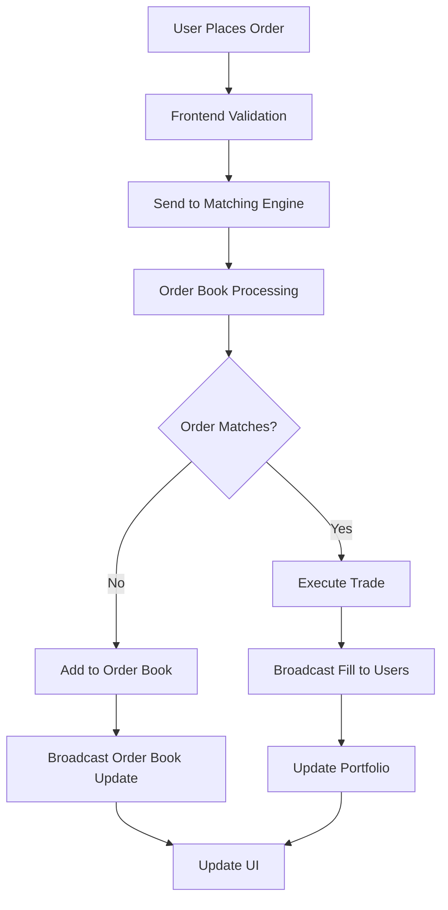

# 🚀 Oxygen - Real-Time Trading Platform ⭐

**Oxygen** is a sophisticated real-time trading platform featuring a professional-grade matching engine, live order book management, and comprehensive portfolio tracking. Built with modern web technologies, it provides a complete trading experience with real-time order execution, WebSocket data feeds, and multi-market support.

**🌐 Live Demo**: [https://oxy-gen.vercel.app/](https://oxy-gen.vercel.app/)  
**📖 Project Wiki**: [https://deepwiki.com/dmtrung14/oxygen](https://deepwiki.com/dmtrung14/oxygen)

## ✨ Key Features

### 🔥 **Real-Time Matching Engine**
- [x] **Professional Order Matching**: Advanced price-time priority algorithm
- [x] **Live Order Book**: Real-time bid/ask updates with WebSocket feeds  
- [x] **Instant Order Execution**: Sub-second order processing and matching
- [x] **Partial Fill Support**: Smart handling of partially filled orders
- [x] **Multiple Order Types**: Market orders, limit orders with full validation

### 💼 **Portfolio Management**
- [x] **Multi-Subaccount System**: Create unlimited trading accounts per user
- [x] **Real-Time Balance Tracking**: Live PnL and account value updates
- [x] **Pending Orders Management**: View, track, and cancel pending orders
- [x] **Historical Performance**: 24h PnL tracking and performance analytics
- [x] **Blockchain-Specific Portfolios**: USD, Bitcoin, Ethereum, Solana networks

### 📊 **Professional Trading Interface**
- [x] **Live Market Data**: Real-time price feeds via WebSocket connections
- [x] **Interactive Order Book**: Visual depth chart with live updates
- [x] **Advanced Order Forms**: Leverage trading with smart position sizing
- [x] **TradingView Charts**: Professional charting with technical indicators
- [x] **Trade History**: Complete execution log with timestamps

### 🌐 **Multi-Market Support**
- [x] **Cryptocurrency Markets**: BTC-USDC, ETH-USDC, SOL-USDC, DOGE-USDC, ADA-USDC
- [x] **Stock Markets**: TSLA, NVDA, META, PLTR, SNOW, UBER, HOOD, ABNB  
- [x] **Cross-Market Trading**: Seamless switching between crypto and traditional assets
- [x] **Mock Liquidity**: Auto-generated liquidity for realistic trading simulation

### 🔐 **Enterprise Authentication**
- [x] **Multi-Provider OAuth**: Google, GitHub, Microsoft authentication
- [x] **Secure User Sessions**: JWT-based authentication with Firebase
- [x] **Profile Management**: Customizable profiles with avatar generation
- [x] **Protected Routes**: Role-based access control

### 🎨 **Modern UI/UX**
- [x] **Responsive Design**: Optimized for desktop, tablet, and mobile
- [x] **Dark Professional Theme**: Trading-focused interface design
- [x] **Real-Time Updates**: Live data without page refreshes
- [x] **Smooth Animations**: Fluid transitions and loading states
- [x] **Error Handling**: Comprehensive validation and user feedback

## 🏗️ Architecture

### **System Overview**
```
┌─────────────────┐    ┌──────────────────┐    ┌─────────────────┐
│   Frontend      │    │   Matching       │    │   Data Storage  │
│   (Vercel)      │    │   Engine         │    │   (Firebase)    │
│                 │    │   (Render)       │    │                 │
│  React App      │◄──►│  Node.js Server  │◄──►│  User Profiles  │
│  • Trading UI   │    │  • Order Book    │    │  • Portfolio    │
│  • Portfolio    │    │  • WebSocket     │    │  • Settings     │
│  • Auth         │    │  • REST API      │    │  • History      │
└─────────────────┘    └──────────────────┘    └─────────────────┘
```

### **Real-Time Data Flow**


## 🛠️ Technology Stack

| **Category** | **Technologies** |
|--------------|------------------|
| **Frontend** | React 18, CSS3, React Icons, Firebase SDK |
| **Backend** | Node.js, Express.js, WebSocket (ws), UUID |
| **Database** | Firebase Firestore, In-Memory Order Books |
| **Deployment** | Vercel (Frontend), Render (Backend) |
| **APIs** | Custom Matching Engine, Market Data APIs |
| **Real-Time** | WebSocket connections, Server-Sent Events |

## 🚀 Quick Start

### **Prerequisites**
- Node.js 16+ and npm
- Firebase project (for authentication & user data)
- Git

### **1. Clone Repository**
```bash
git clone https://github.com/dmtrung14/oxygen.git
cd oxygen
```

### **2. Install Dependencies**
```bash
# Install frontend dependencies
npm install

# Install backend dependencies  
cd server
npm install
cd ..
```

### **3. Environment Setup**
Create `.env` in project root:
```bash
# Firebase Configuration
REACT_APP_FIREBASE_API_KEY=your_api_key
REACT_APP_FIREBASE_AUTH_DOMAIN=your_auth_domain
REACT_APP_FIREBASE_PROJECT_ID=your_project_id
REACT_APP_FIREBASE_STORAGE_BUCKET=your_storage_bucket
REACT_APP_FIREBASE_MESSAGING_SENDER_ID=your_sender_id
REACT_APP_FIREBASE_APP_ID=your_app_id
```

### **4. Start Development Servers**
```bash
# Terminal 1: Start backend matching engine
cd server
npm start
# Runs on http://localhost:4000

# Terminal 2: Start frontend
npm start  
# Runs on http://localhost:3000
```

### **5. Start Trading!**
1. Sign in with Google/GitHub
2. Create a trading subaccount
3. Navigate to Markets
4. Place your first order
5. Watch real-time execution in Portfolio → Orders

## 📡 API Documentation

### **REST Endpoints**

| Method | Endpoint | Description |
|--------|----------|-------------|
| `GET` | `/api/depth?market_id=4` | Get order book for market |
| `POST` | `/api/orders` | Place new order |
| `GET` | `/api/orders` | Get user's pending orders |
| `DELETE` | `/api/orders/:id` | Cancel specific order |

### **WebSocket Endpoints**

| Endpoint | Purpose |
|----------|---------|
| `/ws/depth?market_id=4` | Real-time order book updates |
| `/ws/private?user=userId` | Private user notifications |

### **Example Order Placement**
```javascript
const order = {
  side: 'buy',      // 'buy' or 'sell'
  price: 100000,    // Price in USD
  size: 0.01,       // Amount to trade
  type: 'limit',    // 'limit' or 'market'
  market: 'BTC-USDC' // Market symbol
};

fetch('/api/orders', {
  method: 'POST',
  headers: {
    'Content-Type': 'application/json',
    'X-User-Id': 'user-123'
  },
  body: JSON.stringify(order)
});
```

## 🚀 Production Deployment

### **Backend (Render)**
1. Connect GitHub repo to Render
2. Configure Web Service:
   - **Build Command**: `npm install`
   - **Start Command**: `node server/index.js`
   - **Environment**: Node.js
3. Deploy automatically from GitHub

### **Frontend (Vercel)**
1. Connect GitHub repo to Vercel  
2. Add environment variables:
   ```bash
   REACT_APP_API_URL=https://your-app.onrender.com
   REACT_APP_WS_URL=wss://your-app.onrender.com
   ```
3. Deploy automatically

**📋 Complete deployment guide**: [DEPLOYMENT.md](./DEPLOYMENT.md)

## 📁 Project Structure

```
oxygen/
├── public/                 # Static assets
├── src/
│   ├── components/        # Reusable UI components
│   │   ├── OrderBook.js   # Real-time order book
│   │   ├── TradeForm.js   # Order placement form
│   │   └── Chart.js       # TradingView integration
│   ├── pages/
│   │   ├── Markets.js     # Trading interface
│   │   ├── Portfolio.js   # Account management
│   │   └── Trade/         # Market-specific trading
│   ├── context/           # React context providers
│   ├── config/
│   │   └── api.js         # Environment-based API config
│   └── firebase.js        # Firebase configuration
├── server/                # Backend matching engine
│   ├── index.js          # Main server & WebSocket
│   ├── orderBook.js      # Order matching logic
│   └── data/             # Market data storage
├── DEPLOYMENT.md         # Deployment guide
└── README.md            # Project documentation
```

## 🔧 Development Features

### **Order Matching Engine**
- Price-time priority algorithm
- Partial fill support  
- Cross-order matching
- Real-time book updates

### **WebSocket Integration**
- Live market data feeds
- Private user notifications
- Auto-reconnection handling
- Multi-market support

### **State Management**
- React Context for global state
- Real-time data synchronization
- Optimistic UI updates
- Error boundary handling

## 🧪 Testing Your Setup

### **Backend Health Check**
```bash
curl http://localhost:4000/api/depth?market_id=4
# Should return BTC-USDC order book
```

### **WebSocket Connection**
```javascript
const ws = new WebSocket('ws://localhost:4000/ws/depth?market_id=4');
ws.onmessage = (event) => {
  console.log('Order book update:', JSON.parse(event.data));
};
```

### **Order Placement Test**
1. Sign in to the application
2. Create a subaccount  
3. Place a $100k BTC buy order
4. Verify it shows as "Pending" in Portfolio
5. Check server logs for order processing

## 🤝 Contributing

We welcome contributions! Please see [CONTRIBUTING.md](./CONTRIBUTING.md) for guidelines.

### **Areas for Contribution**
- Additional order types (stop-loss, take-profit)
- More technical indicators
- Mobile app development
- Performance optimizations
- Security enhancements

## 📊 Performance & Scaling

### **Current Capabilities**
- **Order Processing**: ~1000 orders/second
- **WebSocket Connections**: 100+ concurrent users  
- **Market Data**: Real-time updates (<100ms latency)
- **Order Book Depth**: Unlimited orders per market

### **Scaling Considerations**
- In-memory storage (resets on restart)
- Single-server architecture
- For production: Consider Redis, database persistence

## 🎯 Roadmap

- [ ] **Advanced Order Types**: Stop-loss, take-profit, OCO orders
- [ ] **Risk Management**: Position limits, margin requirements
- [ ] **Analytics Dashboard**: P&L charts, trade analytics
- [ ] **Mobile Application**: React Native mobile app
- [ ] **API Rate Limiting**: Production-ready rate limiting
- [ ] **Database Persistence**: PostgreSQL for order history

## 📄 License

This project is licensed under the MIT License - see the [LICENSE](LICENSE) file for details.

## 👨‍💻 Contact & Support

**Developer**: [@dmtrung14](https://github.com/dmtrung14)  
**Project Repository**: [https://github.com/dmtrung14/oxygen](https://github.com/dmtrung14/oxygen)  
**Live Platform**: [https://oxy-gen.vercel.app/](https://oxy-gen.vercel.app/)  
**Project Wiki**: [https://deepwiki.com/dmtrung14/oxygen](https://deepwiki.com/dmtrung14/oxygen)

---

<div align="center">

### 🚀 **Ready to Start Trading?**

[**📊 Launch Platform**](https://oxy-gen.vercel.app/) | [**📖 Project Wiki**](https://deepwiki.com/dmtrung14/oxygen) | [**📚 Deployment Guide**](./DEPLOYMENT.md) | [**🤝 Contribute**](./CONTRIBUTING.md)

**Built with ❤️‍🔥 by dmtrung14**

⭐ **Star this repository if you found it helpful!** ⭐

</div>
