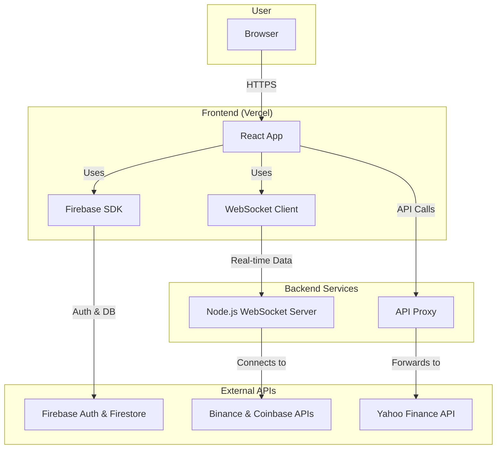

# 🚀 oxygen - Advanced Crypto Trading Sandbox ⭐

[Oxygen](https://oxy-gen.vercel.app/) is a sophisticated crypto trading sandbox designed for developing and testing trading strategies in a simulated, real-time environment. It provides a feature-rich interface that mirrors professional trading platforms, powered by live market data and advanced trading capabilities.

For an in-depth project analysis, see [Devin's analysis](https://deepwiki.com/dmtrung14/oxygen).

## ✨ Key Features

Here's a breakdown of the features currently implemented in `oxygen`, and a few that are on our wishlist for the future.

#### 🔐 Advanced Authentication System
- [x] **Multi-Provider Sign-In**: Google, Microsoft, and GitHub authentication.
- [x] **Profile Management**: Complete user profiles with customizable avatars using DiceBear API.
- [x] **Nickname Validation**: Real-time availability checking with a unique nickname system.
- [x] **Protected Routes**: Secure access control for authenticated features.
- [ ] **Two-Factor Authentication (2FA)**: For an extra layer of security.

#### 💼 Multi-Subaccount Portfolio Management
- [x] **Flexible Account Creation**: Create unlimited subaccounts with unique IDs.
- [x] **Blockchain-Specific Portfolios**: USD, Bitcoin, Ethereum, and Solana networks.
- [x] **Real-time Balance Tracking**: Live account value and PnL calculations.
- [x] **Historical Data**: Daily value tracking and performance analytics.
- [x] **Search & Filter**: Quickly find and manage subaccounts.
- [ ] **CSV Export**: Export portfolio and trade history.

#### 📊 Professional Trading Interface
- [x] **Advanced Order Types**: Market, Limit, Immediate or Cancel, Fill or Kill.
- [x] **Leverage Trading**: Adjustable leverage from 1x to 10x with a visual slider.
- [x] **Order Options**: Reduce-Only and Post-Only order flags.
- [x] **Smart Position Sizing**: Percentage-based position sizing with real-time calculations.
- [x] **Real-time Price Feeds**: Live market data from multiple exchanges.
- [ ] **Trailing Stop Orders**: Advanced order type for risk management.

#### 🌐 Real-time Market Data & Visualization
- [x] **WebSocket Integration**: Live order book updates from Binance and Coinbase.
- [x] **TradingView Charts**: Professional charting with multiple timeframes.
- [x] **Market Overview**: Comprehensive market statistics and 24h performance.
- [x] **Order Book Visualization**: Depth charts with color-coded bid/ask levels.
- [x] **Trade History**: Real-time trade execution tracking.

#### 🎨 Modern UI/UX Design
- [x] **Responsive Design**: Optimized for desktop, tablet, and mobile devices.
- [x] **Dark Theme**: Professional dark interface with gradient backgrounds.
- [x] **Smooth Animations**: Fluid transitions and hover effects.
- [x] **Loading States**: Elegant loading spinners and skeleton screens.
- [x] **Error Handling**: User-friendly error messages and validation.

#### 📈 Comprehensive Market Coverage
- [x] **Crypto Assets**: BTC, ETH, SOL, DOGE, ADA with USDC pairs.
- [x] **Stock Markets**: TSLA, NVDA, META, and other major stocks.
- [x] **Real-time Charts**: Interactive price charts with technical indicators.
- [x] **Market Statistics**: Volume, market cap, and price change data.

## 🛠️ Built With

| Category         | Technologies                                                               |
| ---------------- | -------------------------------------------------------------------------- |
| **Frontend**     | `React 18`, `Firebase`, `TradingView Widget`, `Recharts`, `React Icons`, `CSS3` |
| **Backend**      | `Node.js`, `Express.js`, `WebSocket`, `Firebase Firestore`, `Yahoo Finance API` |
| **Infrastructure**| `Vercel`, `Firebase Hosting`, `API Proxy`                                    |

## 🔧 Technical Architecture

The following diagram illustrates the high-level architecture of the `oxygen` platform, showing the flow of data between the frontend, backend services, and external APIs.



## 🚀 Deployment

### Vercel Deployment
The application is deployed on Vercel with the following configuration:

```json
{
    "rewrites": [
        {
            "source": "/api/:path*",
            "destination": "/api/proxy"
        }
    ]
}
```

### Environment Variables
Set up the following environment variables for full functionality:

```bash
# Firebase Configuration
REACT_APP_FIREBASE_API_KEY=your_api_key
REACT_APP_FIREBASE_AUTH_DOMAIN=your_auth_domain
REACT_APP_FIREBASE_PROJECT_ID=your_project_id
REACT_APP_FIREBASE_STORAGE_BUCKET=your_storage_bucket
REACT_APP_FIREBASE_MESSAGING_SENDER_ID=your_sender_id
REACT_APP_FIREBASE_APP_ID=your_app_id

# Trading Engine (Optional)
REACT_APP_ENGINE_URL=your_engine_url
ENABLE_BINANCE=true
COINBASE_PRODUCT=BTC-USD
```

## 🏃‍♂️ Getting Started

### Prerequisites
- Node.js (v16 or higher)
- npm or yarn
- Firebase project setup

### Installation

1. **Clone the repository**
   ```bash
   git clone https://github.com/dmtrung14/oxygen.git
   cd oxygen
   ```

2. **Install dependencies**
   ```bash
   npm install
   ```

3. **Set up environment variables**
   Create a `.env` file in the root directory with your Firebase configuration.

4. **Start the development server**
   ```bash
   npm start
   ```

5. **Start the backend server** (optional, for full functionality)
   ```bash
   cd backend
   npm install
   npm start
   ```

## 🤝 Contributing

Contributions are what make the open source community such an amazing place to learn, inspire, and create. Any contributions you make are **greatly appreciated**.

Please see the [contributing guide](CONTRIBUTING.md) for details on how to get started.

## 📄 License

This project is licensed under the MIT License - see the [LICENSE](LICENSE) file for details.

## 👨‍💻 Contact

**dmtrung14** - [@dmtrung14](https://github.com/dmtrung14)

**Project Link**: [https://github.com/dmtrung14/oxygen](https://github.com/dmtrung14/oxygen)

**Live Demo**: [Deployed on Vercel](https://your-vercel-url.vercel.app)

---

<div align="center">
  <p>Made with ❤️‍🔥 by <a href="https://github.com/dmtrung14">dmtrung14</a></p>
  <p>⭐ Star this repository if you found it helpful!</p>
</div>
