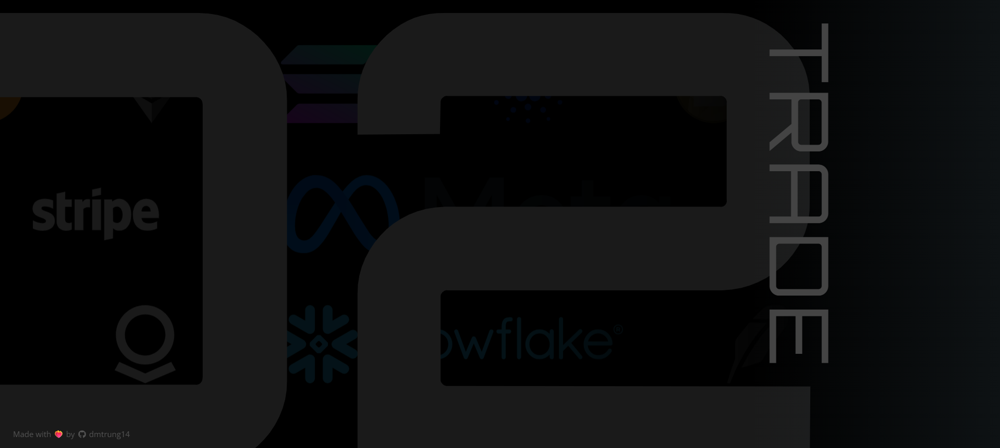

# 🚀 O2 Arena - Advanced Crypto Trading Sandbox ⭐

O2 Arena is a sophisticated crypto trading sandbox designed for developing and testing trading strategies in a simulated, real-time environment. It provides a feature-rich interface that mirrors professional trading platforms, powered by live market data and advanced trading capabilities.

## ✨ Key Features

### 🔐 **Advanced Authentication System**
- **Multi-Provider Sign-In**: Google, Microsoft, and GitHub authentication
- **Profile Management**: Complete user profiles with customizable avatars using DiceBear API
- **Nickname Validation**: Real-time availability checking with unique nickname system
- **Protected Routes**: Secure access control for authenticated features

### 💼 **Multi-Subaccount Portfolio Management**
- **Flexible Account Creation**: Create unlimited subaccounts with unique IDs
- **Blockchain-Specific Portfolios**: USD, Bitcoin, Ethereum, and Solana networks
- **Real-time Balance Tracking**: Live account value and PnL calculations
- **Historical Data**: Daily value tracking and performance analytics
- **Search & Filter**: Quick subaccount discovery and management

### 📊 **Professional Trading Interface**
- **Advanced Order Types**: Market, Limit, Immediate or Cancel, Fill or Kill
- **Leverage Trading**: Adjustable leverage from 1x to 10x with visual slider
- **Order Options**: Reduce-Only and Post-Only order flags
- **Smart Position Sizing**: Percentage-based position sizing with real-time calculations
- **Real-time Price Feeds**: Live market data from multiple exchanges

### 🌐 **Real-time Market Data**
- **WebSocket Integration**: Live order book updates from Binance and Coinbase
- **TradingView Charts**: Professional charting with multiple timeframes
- **Market Overview**: Comprehensive market statistics and 24h performance
- **Order Book Visualization**: Depth charts with color-coded bid/ask levels
- **Trade History**: Real-time trade execution tracking

### 🎨 **Modern UI/UX Design**
- **Responsive Design**: Optimized for desktop, tablet, and mobile devices
- **Dark Theme**: Professional dark interface with gradient backgrounds
- **Smooth Animations**: Fluid transitions and hover effects
- **Loading States**: Elegant loading spinners and skeleton screens
- **Error Handling**: User-friendly error messages and validation

### 📈 **Comprehensive Market Coverage**
- **Crypto Assets**: BTC, ETH, SOL, DOGE, ADA with USDC pairs
- **Stock Markets**: TSLA, NVDA, META, and other major stocks
- **Real-time Charts**: Interactive price charts with technical indicators
- **Market Statistics**: Volume, market cap, and price change data

## 🛠️ Built With

### Frontend
- **React 18** - Modern React with hooks and context
- **Firebase** - Authentication and real-time database
- **TradingView Widget** - Professional charting
- **Recharts** - Custom chart components
- **React Icons** - Icon library
- **CSS3** - Advanced styling with gradients and animations

### Backend
- **Node.js** - Server-side runtime
- **Express.js** - Web framework
- **WebSocket** - Real-time data streaming
- **Firebase Firestore** - NoSQL database
- **Yahoo Finance API** - Market data provider

### Infrastructure
- **Vercel** - Frontend deployment and hosting
- **Firebase Hosting** - Alternative deployment option
- **API Proxy** - CORS-free data fetching

## 🚀 Deployment

### Vercel Deployment
The application is deployed on Vercel with the following configuration:

```json
{
    "rewrites": [
        {
            "source": "/api/:path*",
            "destination": "/api/proxy"
        }
    ]
}
```

### Environment Variables
Set up the following environment variables for full functionality:

```bash
# Firebase Configuration
REACT_APP_FIREBASE_API_KEY=your_api_key
REACT_APP_FIREBASE_AUTH_DOMAIN=your_auth_domain
REACT_APP_FIREBASE_PROJECT_ID=your_project_id
REACT_APP_FIREBASE_STORAGE_BUCKET=your_storage_bucket
REACT_APP_FIREBASE_MESSAGING_SENDER_ID=your_sender_id
REACT_APP_FIREBASE_APP_ID=your_app_id

# Trading Engine (Optional)
REACT_APP_ENGINE_URL=your_engine_url
ENABLE_BINANCE=true
COINBASE_PRODUCT=BTC-USD
```

## 🏃‍♂️ Getting Started

### Prerequisites
- Node.js (v16 or higher)
- npm or yarn
- Firebase project setup

### Installation

1. **Clone the repository**
   ```bash
   git clone https://github.com/dmtrung14/O2Arena.git
   cd O2Arena
   ```

2. **Install dependencies**
   ```bash
   npm install
   ```

3. **Set up environment variables**
   Create a `.env` file in the root directory with your Firebase configuration.

4. **Start the development server**
   ```bash
   npm start
   ```

5. **Start the backend server** (optional, for full functionality)
   ```bash
   cd backend
   npm install
   npm start
   ```

## 📱 Features Overview

### Landing Page
- **Animated Background**: Multi-layered scrolling logo animation
- **Responsive Design**: Optimized for all screen sizes
- **Smooth Navigation**: Seamless transition to trading interface

### Trading Interface
- **Market Selector**: Quick switching between different assets
- **Order Book**: Real-time depth visualization
- **Trade Form**: Advanced order placement with validation
- **Portfolio Overview**: Real-time account balance and positions

### Portfolio Management
- **Subaccount Creation**: Easy setup with blockchain selection
- **Performance Tracking**: Historical PnL and account value charts
- **Position Management**: View and manage open positions
- **Order History**: Complete trade execution records

### Markets Page
- **Market Overview**: Comprehensive asset listing
- **Price Charts**: Interactive mini-charts for each asset
- **Filtering Options**: Search and filter by asset type
- **Quick Trading**: Direct navigation to trading interface

## 🔧 Technical Architecture

### Frontend Architecture
- **Component-Based**: Modular React components
- **Context API**: Global state management
- **Custom Hooks**: Reusable logic encapsulation
- **Responsive Design**: Mobile-first approach

### Backend Architecture
- **WebSocket Server**: Real-time data streaming
- **REST API**: Traditional HTTP endpoints
- **Order Book Engine**: Matching engine simulation
- **Market Data Integration**: Multi-source data aggregation

### Data Flow
1. **Market Data**: WebSocket connections to exchanges
2. **User Actions**: Firebase authentication and data storage
3. **Order Processing**: Real-time order matching and execution
4. **Portfolio Updates**: Live balance and position tracking

## 🤝 Contributing

1. Fork the repository
2. Create a feature branch (`git checkout -b feature/AmazingFeature`)
3. Commit your changes (`git commit -m 'Add some AmazingFeature'`)
4. Push to the branch (`git push origin feature/AmazingFeature`)
5. Open a Pull Request

## 📄 License

This project is licensed under the MIT License - see the [LICENSE](LICENSE) file for details.

## 👨‍💻 Contact

**dmtrung14** - [@dmtrung14](https://github.com/dmtrung14)

**Project Link**: [https://github.com/dmtrung14/O2Arena](https://github.com/dmtrung14/O2Arena)

**Live Demo**: [Deployed on Vercel](https://your-vercel-url.vercel.app)

---

<div align="center">
  <p>Made with ❤️‍🔥 by <a href="https://github.com/dmtrung14">dmtrung14</a></p>
  <p>⭐ Star this repository if you found it helpful!</p>
</div>
